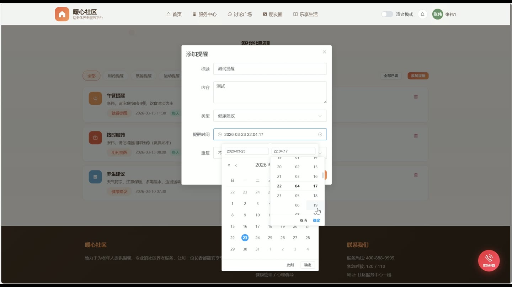
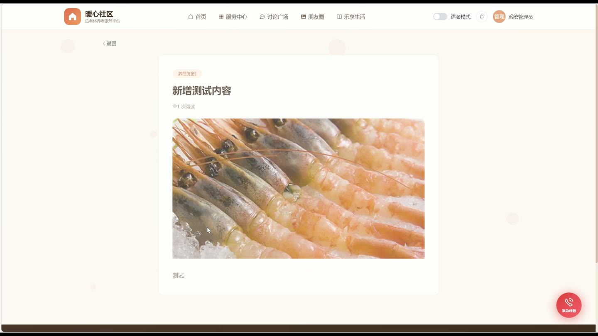
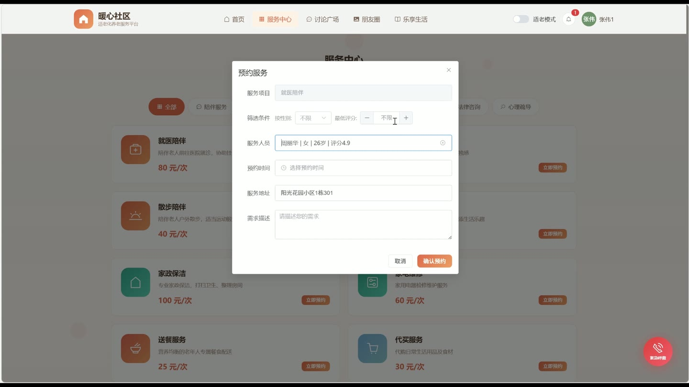
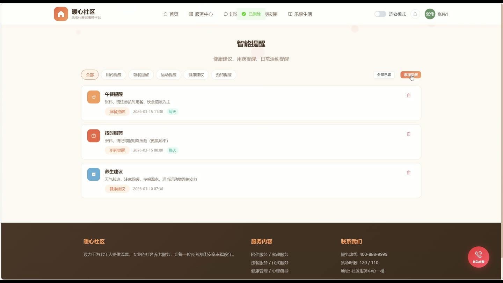
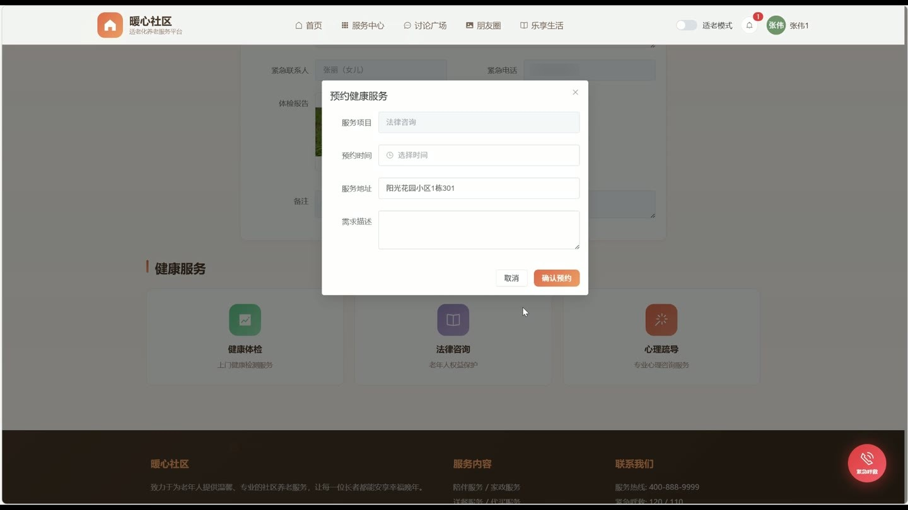

# (附文档)Springboot2+Vue3+MySQL 适老化养老与社区服务管理系统

**技术栈**：Springboot2、Vue3、MySQL

### 系统简介

本系统是一款基于 SpringBoot2 + Vue3 前后端分离架构的适老化养老与社区服务管理平台。系统围绕老年人日常生活需求，提供服务预约、健康档案管理、智能提醒、紧急呼救、社区论坛、兴趣内容、膳食管理、服务人员接单与评价等完整功能闭环。系统包含普通用户端、服务人员端、管理员端三大角色，各角色拥有独立的功能界面与权限体系。
 
### 核心功能
 
### 普通用户端

 
- 查看首页轮播图、服务分类、热门兴趣内容及平台统计数据（用户/服务人员/订单数量） 
- 浏览服务分类列表（按类型筛选、排序），查看分类详情（名称、图标、描述、价格） 
- 创建服务预约订单：选择服务分类、填写服务标题/描述/地址/预约时间，系统自动生成订单号并设置初始价格 
- 查看我的服务订单列表（支持按状态筛选），查看订单详情（订单信息、用户信息、服务人员信息、分类信息） 
- 对已完成的服务订单进行评价：填写评分（1-5分）和评价内容，评价后订单状态自动变为已完成 
- 查看服务人员列表（按性别/年龄/评分/技能筛选），展示服务人员头像、姓名、评分、技能标签、服务状态 
- 管理个人健康档案：填写血型、过敏史、慢性病、既往病史、紧急联系人及电话、体检报告、用药记录、备注 
- 创建智能提醒：设置提醒标题、内容、类型（如用药/复诊）、提醒时间、重复类型，标记已读/全部已读 
- 发起紧急呼救：选择呼救类型、填写描述和位置，系统自动填充用户地址，呼救状态初始为待处理 
- 查看我的紧急呼救记录列表（按时间倒序） 
- 浏览论坛帖子列表（按类型/话题/关键词搜索），查看帖子详情（含作者信息、评论列表、点赞/评论数） 
- 发布论坛帖子：填写标题、内容、图片、话题、类型，系统自动初始化浏览/点赞/评论数为0 
- 对帖子进行点赞/取消点赞操作，发布评论（支持嵌套回复） 
- 浏览兴趣内容列表（按分类/关键词搜索），查看内容详情（标题、正文、封面图，自动递增浏览量） 
- 查看膳食/餐品列表（按分类筛选），展示餐品名称、分类、封面图、价格、描述、营养信息、适宜人群 
- 个人资料编辑：修改真实姓名、手机号、头像、性别、年龄、地址、个人简介 
- 切换适老化模式（大字体/高对比度），全局生效
 
### 服务人员端

 
- 查看待接单的服务订单列表（支持按状态筛选），订单包含用户信息和分类信息 
- 接单操作：将订单状态从待处理更新为已接单，系统自动记录当前服务人员ID 
- 更新服务订单状态：进行中、已完成、已取消，完成时自动记录完成时间 
- 查看服务人员收到的评价列表（按时间倒序），展示评价用户信息、评分、评价内容 
- 对用户评价进行回复：填写回复内容，系统记录回复时间 
- 查看个人收到的评价统计（平均评分自动计算并更新到个人资料） 
- 编辑个人资料：修改头像、手机号、个人简介、技能标签、证书、服务状态 
- 查看个人资料中的评分（由系统根据所有评价自动计算）
 
### 管理员端

 
- 查看仪表盘统计：总订单数、待处理/进行中/已完成/已取消订单数量 
- 查看订单分类统计：按服务分类统计订单数量，展示分类名称和类型 
- 查看近7天每日订单趋势（折线图），近6个月每月订单和用户注册趋势 
- 用户管理：按角色/关键词/状态搜索用户列表，查看用户详情，编辑用户信息（可重置密码），审核服务人员入驻申请（通过/拒绝），删除用户 
- 服务分类管理：新增/编辑/删除服务分类（名称、类型、图标、封面、描述、价格、排序、状态） 
- 订单管理：查看所有订单列表（按状态/关键词搜索），查看订单详情（含用户/服务人员/分类信息） 
- 膳食/餐品管理：新增/编辑/删除餐品（名称、分类、封面、价格、描述、营养、适宜人群、状态、排序） 
- 轮播图管理：新增/编辑/删除轮播图（标题、图片链接、跳转链接、排序、类型、启用/停用） 
- 兴趣内容管理：新增/编辑/删除兴趣内容（标题、正文、封面、分类，系统自动管理浏览量） 
- 紧急呼救管理：查看所有呼救记录（按状态筛选），查看呼救详情（含呼救用户信息），处理呼救（标记已处理/已完成，填写处理结果） 
- 查看待处理呼救数量（未处理和进行中的呼救总数）
 
### 技术栈

 后端框架Spring Boot 2.7.x ORMMyBatis-Plus（自动填充、逻辑删除、分页插件） 权限认证JWT（拦截器校验，登录/注册/公开接口放行） 前端框架Vue 3（Composition API + setup 语法） 状态管理Pinia（用户状态、适老化模式） UI 组件库Element Plus 构建工具Vite 数据库MySQL 8.x 工具库Hutool（MD5加密、UUID生成）
 
### 交付内容

 
- 后端完整源码 
- 前端完整源码 
- 数据库初始化脚本 
- 万字文档

## 界面展示

---

## 获取完整源码 + 万字文档

本仓库为项目介绍页。**完整前后端源码、数据库初始化脚本、万字项目文档**，请加微信 `kangkangcode`，或访问 [codekk.top](http://codekk.top) 获取。

可作课程设计 / 毕业设计参考，支持远程部署调试。